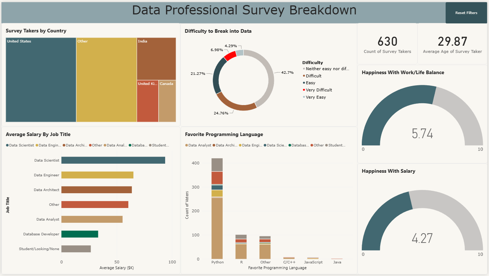

# Data Professional Survey Dashboard | Power BI

An interactive Power BI dashboard that analyses a survey of 630 data professionals: who they are, what they earn, which programming languages they prefer, where they live, how satisfied they are, and how hard it was to break into the field.



**Tools:** Power BI Desktop · Power Query · Excel

## Business questions
- What do data professionals earn, and how does it vary by job title and country?
- Which programming languages do they prefer?
- How satisfied are they with salary and work/life balance?
- How difficult is it to break into the field?

## What I did

I took a raw survey export in Excel and turned it into a clean data model and a single-page interactive dashboard.

### 1. Cleaned and transformed the data in Power Query
- **Removed empty columns** that had no analytical value.
- **Standardised free-text answers.** Job title, industry and country contained many `Other (Please Specify): ...` entries. I split these columns on the parenthesis and dropped the detail so each field has a small set of comparable categories.
- **Cleaned the favorite-language field** the same way, splitting on `:` so custom answers fall under `Other`.
- **Converted salary ranges into a numeric field.** Salaries were stored as bands such as `41k-65k` and `225k+`. I duplicated the original column to keep it, split the bands into lower and upper bounds by digit/non-digit transitions, removed the `K` and `-` characters, handled the `225k+` band by replacing `+` with `225` so those records were kept, converted both bounds to whole numbers, and created an **Average Salary** column as the midpoint of each band. The helper columns were then removed.
- **Fixed data types** so Power BI could aggregate the fields correctly.

### 2. Built the dashboard
| Visual | Purpose |
|---|---|
| Cards | Number of survey takers (630) and average age (29.87) |
| Treemap | Survey takers by country; also used as a filter for the whole page |
| Bar chart | Average salary by job title |
| Stacked column chart | Favorite programming language, split by job title |
| Donut chart | How difficult respondents found it to break into data (labels as % of total, custom slice colors) |
| Gauges (0–10) | Happiness with work/life balance (5.74) and with salary (4.27) |

### 3. Added interactivity and polish
- Configured **cross-filtering and cross-highlighting** so clicking a country (for example India) updates every other visual, and tooltips show the selected group next to the overall value.
- Renamed tooltip fields so they read clearly instead of showing the raw survey question text.
- Created a **bookmark and a "Reset Filters" button** that returns the report to its default state.
- Applied a report **theme**, customised colors, and aligned and sized all visuals for a clear reading order: header, survey size, geography, salary, languages, difficulty, satisfaction.

## Key Insights and Business Recommendations

The following findings are based on the Data Professional Survey dashboard (630 respondents).

| # | Key Insight | Evidence from the Dashboard | Business Recommendation |
|---|---|---|---|
| 1 | **Average salaries vary significantly by country.** | Average salary is approximately **$79K in the US**, **$68K in Canada**, **$46K in the UK**, and **$30K in India**. | Companies should consider location when setting salaries and compare offers with local market rates. |
| 2 | **Data Scientists report higher salaries than Data Engineers and Data Analysts.** | Data Scientists average approximately **$94K**, compared with **$65K for Data Engineers** and **$55K for Data Analysts**. Data Analysts represent about **60% of respondents (381 of 630)**. | Data Analysts interested in career growth could develop skills in data engineering, machine learning, or advanced analytics. |
| 3 | **Respondents are happier with work-life balance than with salary.** | Average salary satisfaction is **4.27/10**, compared with **5.74/10** for work-life balance. | Employers could review compensation while maintaining supportive and flexible working conditions. |
| 4 | **Python is the most popular programming language among respondents.** | Approximately **67% prefer Python**, followed by **R at 16%**. | Training programs could prioritize Python while also offering R for statistics and research. |
| 5 | **Respondents report mixed experiences entering the data field.** | **42.7%** selected *Neither easy nor difficult*, **24.8%** selected *Difficult*, and **7%** selected *Very difficult*. | Training providers could offer beginner courses, practical projects, and portfolio-building opportunities. |
| 6 | **Respondents are concentrated in a few country categories.** | The **US** is the largest individual country category in the Treemap, while many other countries are grouped under *Other*. | Analysts should consider sample sizes before interpreting country-level results, particularly for smaller groups. |

*Note: Salary estimates are based on salary-range midpoints. Detailed figures should be verified against the Power BI dashboard before publication. These results describe survey respondents, not the entire data-professional workforce.*

## Limitations
- The sample is self-selected and covers only these 630 respondents.
- Salary was collected as ranges, so Average Salary is a midpoint approximation, and the top band is open-ended.
- Salaries are in nominal USD and are not adjusted for cost of living between countries.

## Repository
```
├── dashboard/   Power BI report (.pbix)
├── data/raw/    Original survey data (.xlsx)
└── images/      Dashboard screenshot
```
Open the `.pbix` in Power BI Desktop and click a country in the treemap to explore. Use **Reset Filters** to go back to the default view.

## Author
**Elnaz Khodadadi** — Data Analyst | Power BI · Power Query · Excel
GitHub: [@ekhodada](https://github.com/ekhodada) · LinkedIn: [elnaz-khodadadi](https://www.linkedin.com/in/elnaz-khodadadi-547868a6/)
